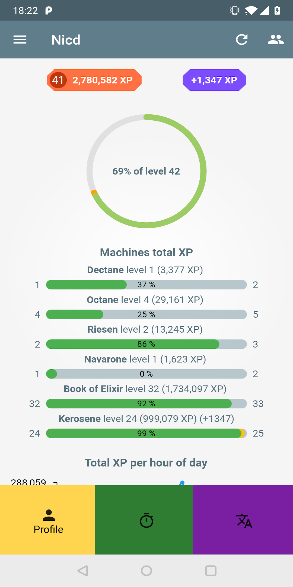
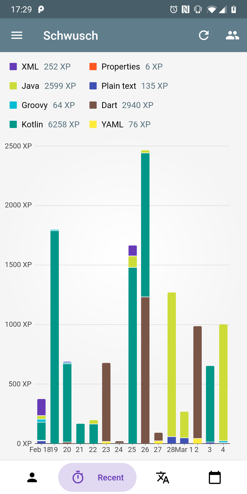
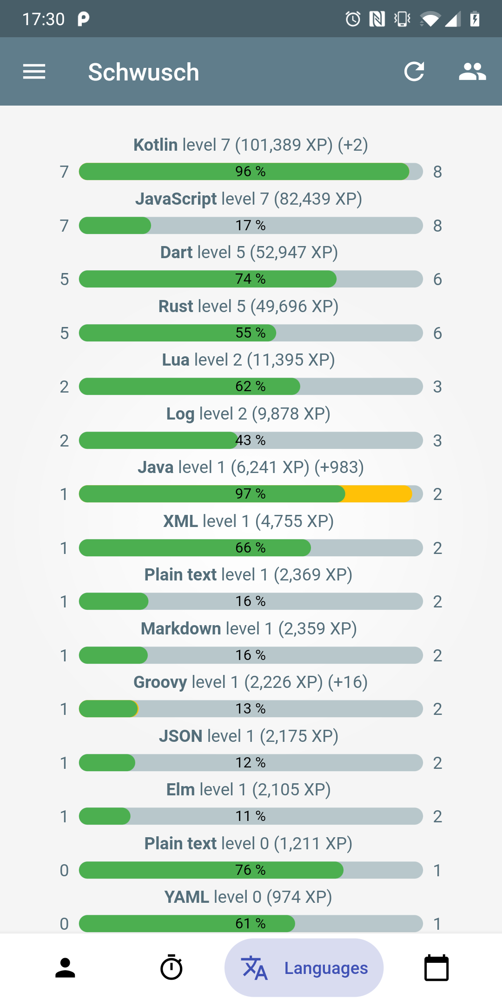
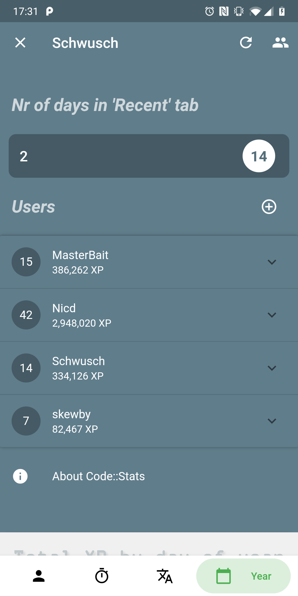
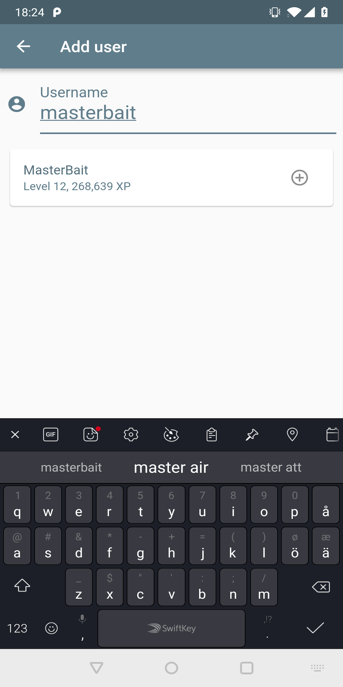

# Code::Stats Viewer

 |   |  
| ------------------------- | ------------------------- | -----------
 |   |  

## Running the app

To run this project:
 - Follow the [Flutter installation instructions](https://flutter.io/setup/)
 - Clone this project and run `flutter doctor` in the project root directory
 - Run `flutter run`

## The code

Application-specific code is in [/lib](/lib).